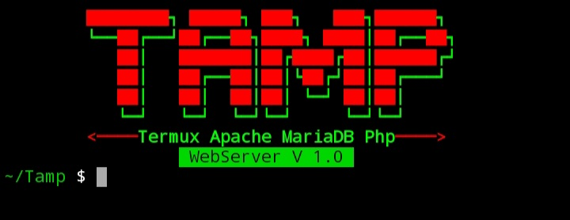

 
# Tamp
Tamp :- TERMUX APACHE MARIADB PHP WEBSERVER  
Tamp is a local http web server for Android included Apache and with Php, mariadDb Mysql enabled. 
This tool is an easy to use with simple commands. 
Tamp is use MariaDb the old MySQL server is also included PhpMyAdmin feature. 

<b> This Web Server included with these features:</b>
<ul>
  <li>Apache2</li>
  <li>Php 7</li>
  <li>MariaDB</li>
  <li>PhpMyAdmin</li>
  <li>DocumentRoot Options</li>
  <li>Check http Access & Error Logs</li>
  <li>Clear log files history</li>
 </ul>
 
 <h4>Installation:</h4>

 git clone https://github.com/1Tech-X/Tamp.git 
 cd Tamp  
 bash install.sh 
 
 <h4>Usage:</h4>
 tamp -h 
 
